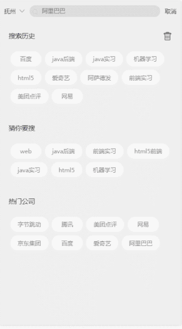
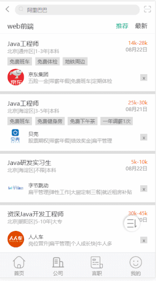
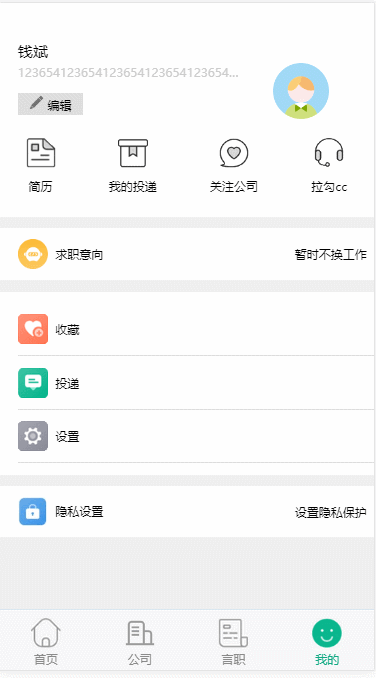
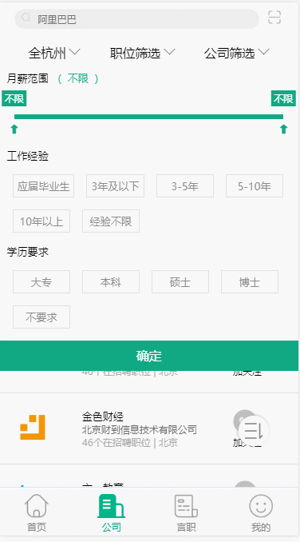
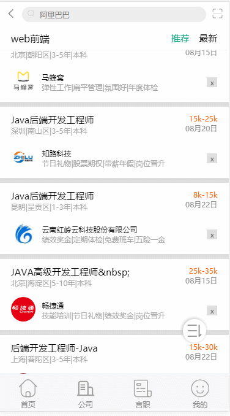

# 全栈系列Vue版拉勾，客官们来瞧瞧
模拟拉勾app系列---vue前端界面

### 前言
本项目是本人在闲暇时间编写的一个初级引导项目，麻雀虽小五脏俱全，所使用的东西绝大多数在开发中都能用得到，但难免会存在很多地方需要完善。

由于近期要备战法考，且工作繁忙，没有时间维护，还存在很多BUG或需要优化的地方，希望多多提出（有空了就改），当然能给个star什么的就更好了.

为了方便访问，也加入了mock数据,但不是很全，若需要完整体验，请按照下方步骤实现。

前端项目由Vue框架编写，其余部分涉及到node、python等可移至下方项目或自行查阅。
### 注意：本项目个人开发练习，不作为任何商业用途

# todolist
+ ~~登录/注册~~  √
+ ~~页面首次加载面~~ √
+ ~~城市选择~~ √
+ ~~文章阅读~~ √
+ ~~搜索职位~~ √
+ ~~条件筛选~~ √
+ ~~搜索公司~~ √
+ ~~下拉刷新上拉加载~~ √
+ ~~数据排序~~ √
+ ~~图片懒加载~~ √
+ ~~提问评论~~√
+ ~~提问信息编辑~~ √
+ ~~言职社区记录~~ √
+ ~~话题关注~~ √
+ ~~收藏~~√
+ ~~求职意向~~√
+ ~~投递记录~~√
+ ~~注销~~√
+ ~~基础设置~~√
+ ~~头像修改~~ √
+ ~~简历填写~~√
+ ~~简历生成并下载pdf~~√
+ ~~采用cdn加载，优化打包后vendor大小~~√
+ ps:还有很多很多东西，不一一列举，想到啥就做啥

# 技术栈
前端：
+ vue全家桶
+ es6
+ scss
+ mint-ui
+ mockjs
+ jquery

转发服务器：
+ node
+ express

实际api服务器:
+ python3
+ mongodb

爬虫：
+ python3

# 效果演示
### 首次载入

### 登录注册

### 首页

### 文章阅读

### 选择城市

### 职位查看

### 筛选

### 排序

### 排序2

### 简历修改

### 我的设置

ps:还有更多的设置就不截图了，有点大，有兴趣的clone下去看看吧
# 线上地址

# 说明
前端地址:https://github.com/qianbin01/lagou_vue

代理api地址:https://github.com/qianbin01/lagou_node

api地址:https://github.com/qianbin01/lagou_python_api

爬虫地址:https://github.com/qianbin01/lagou_spider
# 项目配置
ubuntu 16.04
# 运行步骤
  必备步骤：
  1. 运行爬虫项目
  2. 运行python-api项目
  3. 运行node-api转发项目
  4. 运行本项目
  
  本项目步骤：
  1. git clone https://github.com/qianbin01/lagou_vue.git
  2. cd lagou_vue
  3. npm install/yarn install
  4. npm run dev/npm start
  5. 浏览器访问http://localhost:8085
  

# 点点你们的小手吧
知乎专栏：https://zhuanlan.zhihu.com/c_1010582778160779264  
掘金:https://juejin.im/user/5b8291bce51d4538ab043911  
思否:https://segmentfault.com/u/qishidexinxin  

希望对大家有帮助

大佬们赞助一波续费服务器吧

# License
    MIT
